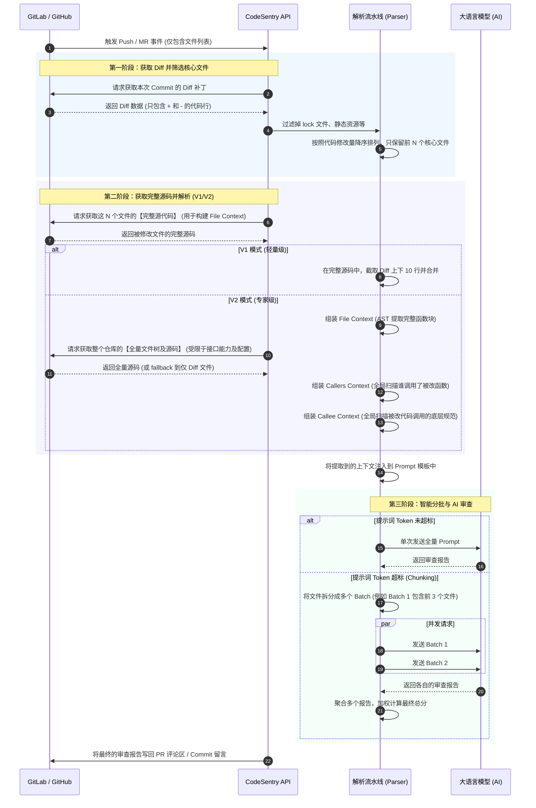

# CodeSentry

<div align="center">
  
</div>

> **声明 / Disclaimer**: 
> 本项目为基于 [huangang/codesentry](https://github.com/huangang/codesentry) 二次开发的分支版本，主要用于**学习、教育及架构研究用途**。
> 感谢原作者 [huangang](https://github.com/huangang) 提供的优秀开源基础。

CodeSentry 是一款具备双引擎 (V1/V2) 智能上下文解析与超大 PR 自动分批审查能力的专业级 AI 代码审查系统，支持 GitHub、GitLab。

## 技术栈

- **后端**: Go 1.24+ (Fiber, GORM, Tree-sitter AST 解析)
- **前端**: React 18, TypeScript, Vite, TailwindCSS
- **数据库**: PostgreSQL
- **队列/缓存**: Redis (用于异步任务和去重)
- **大模型接入**: 原生支持 OpenAI, Anthropic (Claude), Ollama, Google Gemini

## 核心架构与操作流程

本系统在处理代码审查时，支持两种完全不同的触发链路：**异步 Webhook 触发** (常规 Push/MR) 和 **同步 API 触发** (用于 Git Pre-receive hook 拦截)。

以下时序图展示了从代码提交到 AI 返回审查结果的完整交互过程。
*(阅图指南：从上往下看，箭头代表动作的发起方和接收方，虚线代表数据的返回。)*



## 提示词工程 (Prompt Engineering) 指南

为了让大模型能够精准地理解代码并输出结构化的审查报告，系统采用了**变量注入**和**严格指令**相结合的 Prompt 设计。在给技术 Leader 演示时，可以重点介绍以下设计哲学：

### 1. 核心上下文变量 (Variables)
系统在发起 AI 请求前，会将真实提取到的代码上下文替换掉 Prompt 中的占位符：
- `{{file_context}}`: 包含当前被修改文件的完整上下文（V1 模式为片段合并，V2 模式为完整函数块），并用 `+` 和 `-` 精确标记修改行。
- `{{callers_context}}`: (仅 V2) 注入调用了被修改函数的上游代码块。
- `{{callee_context}}`: (仅 V2) 注入被修改代码中所调用的底层函数定义。
- `{{commits}}`: 注入本次提交的 Commit Message 历史，帮助 AI 理解开发者的修改意图。

### 2. 编写与修改 Prompt 的“讲究”
如果您需要在后台修改系统提示词，请务必遵循以下原则：

*   **必须强制 AI 聚焦修改行**：
    由于我们提供了完整的函数上下文，如果不加约束，AI 会去“挑刺”函数里原本就存在的历史老 Bug。
    *正确写法示例*：`你只能审查带有 '+'（新增）和 '-'（删除）标记的代码行，以及它们对当前函数逻辑的直接影响。严禁指出未修改代码中的问题。`
*   **引导双向依赖检查 (V2 特属)**：
    必须在 Prompt 中明确告诉 AI 怎么使用 `{{callers_context}}` 和 `{{callee_context}}`。
    *正确写法示例*：`如果本次修改改变了某函数的输入/输出，必须检查下方的【跨文件调用影响分析 (Callers)】，确认是否导致其他调用方崩溃。`
*   **按函数/模块结构化输出**：
    为了让开发者一目了然，建议强制 AI 按照修改的函数名进行分组输出，并规定只输出有问题的部分。
    *正确写法示例*：`请遍历提供的 Context，以被修改的函数/类为单位进行输出。如果该函数修改没有问题，请仅输出“✅ 该函数修改无异常”。`
*   **强制打分格式**：
    系统后端会正则匹配 AI 返回的文本来提取分数，如果格式不对会导致分数解析失败（默认为 0）。
    *正确写法示例*：`请在结尾严格按此格式输出总分："总分:XX 分"（例如：总分:80 分）。`

### 3. 如何屏蔽不必要的上下文以节省 Token？
如果您的项目非常庞大，为了极致省钱，您可以在 Prompt 模板中直接**删除**不需要的变量。
例如：将 `{{repo_map}}` 占位符从 Prompt 中删除。后端在渲染时发现 Prompt 里没有这个变量，就会智能跳过对应的解析逻辑，从而节省计算资源和 Token 开销。

## 双引擎解析逻辑 (V1 vs V2)

为了在“审查精度”与“Token 成本/响应速度”之间取得最佳平衡，系统内置了两套代码解析引擎：

### V1 模式：轻量级极速审查
- **定位**：适合日常小迭代、前端 UI 微调、配置文件修改，成本极低。
- **逻辑**：不解析语法，纯文本提取修改点（Diff）上下 10 行。若多个修改点距离较近，自动合并为一个连贯代码块。

**V1 处理流程示例**：
```text
修改点 1 (Line 100) -> 提取 90~110 行
修改点 2 (Line 115) -> 提取 105~125 行
--- 智能合并 ---
最终发给 AI：提取 90~125 行 (包含两个修改点，无割裂感)
```

### V2 模式：专家级深度审查 (AST 语法树)
- **定位**：适合核心业务重构、底层数据结构变更，主打高精度防雷。
- **逻辑**：
  1. **Function Context**：将修改点所在的**整个函数/类**完整提取出来。
  2. **Callers Context (向上追溯)**：全网扫描谁调用了被修改的函数。
  3. **Callee Context (向下校验)**：全网扫描本次修改中调用的底层函数定义。
  4. **Orphan Hunks (孤儿代码)**：自动捕获全局变量、import 导入等不在函数内的代码。

**V2 处理流程示例**：
```text
用户修改了 `user.go` 中的 `func CheckAuth(token string) bool` -> 改为了 `func CheckAuth(token string, age int) bool`

系统自动收集并发给 AI：
1. [File Context]: 完整的 `CheckAuth` 源码，并用 + 和 - 标出改动。
2. [Callers Context]: 自动从 `api.go` 提取调用了 `CheckAuth` 的代码片段（AI 借此发现 api.go 还在传 1 个参数，抛出致命 Bug）。
```

## 核心 API 接口说明

### 后端核心接口
- `POST /api/webhook/:platform/:uuid`
  - **功能**: 接收代码托管平台的 Webhook 事件，触发审查队列。
- `GET /api/projects`
  - **功能**: 获取项目列表，配置代码仓库的鉴权信息、使用的 LLM 模型及审查模式 (V1/V2)。
- `POST /api/projects`
  - **功能**: 新增项目绑定。
- `PUT /api/prompts/:id`
  - **功能**: 更新提示词模板，支持动态注入 `{{file_context}}`、`{{callers_context}}` 等上下文变量。
- `GET /api/logs/review`
  - **功能**: 查询历史审查日志，支持分页、状态检索。
- `POST /api/logs/review/batch-retry`
  - **功能**: 批量重新触发失败或不满意的审查任务。
- `GET /metrics`
  - **功能**: Prometheus 监控指标接口，实时暴露队列堆积、API 耗时及大模型请求状态。

### 前端核心接口服务 (`src/services/api.ts`)
- `api.getProjects()` / `api.createProject()`: 项目管理接口调用。
- `api.getReviewLogs()`: 获取审查流水和统计数据。
- `api.getPrompts()` / `api.updatePrompt()`: 系统 Prompt 管理。

## 编译与 Docker 打包部署流程

### 1. 本地编译与运行 (开发环境)
**后端编译**:
```bash
cd backend
# 复制并修改配置文件 (配置 Postgres 连接)
cp ../config.yaml.example config.yaml
# 运行后端服务
go run ./cmd/server
```

**前端编译**:
```bash
cd frontend
npm install
npm run dev
```

### 2. Docker 生产环境一键部署 (推荐)
项目根目录提供了完整的 `docker-compose.yml`，它会自动帮您拉起 **CodeSentry 主程序** 和 **PostgreSQL 数据库**（如果需要还可以扩展 Redis）。

**获取离线镜像包 (适用于内网部署)**:
如果您已经拿到打包好的 `.tar` 文件，可以直接加载：
```bash
docker load -i code-reviewer-aoi.tar
```

**配置并启动**:
1. 确保当前目录下有 `docker-compose.yml` 文件。
2. 检查 `docker-compose.yml` 中的环境变量配置（如数据库密码、端口等）。
3. 一键拉起所有服务：
```bash
docker-compose up -d
```

**关于 docker-compose 的原理解释**:
- **PostgreSQL 容器 (`db`)**: 系统会自动下载 `postgres:15-alpine` 镜像作为主数据库，并将数据持久化挂载到宿主机的 `./data/postgres` 目录下，防止重启丢失数据。
- **CodeSentry 容器 (`app`)**: 依赖于数据库启动。它通过内部网络直接连接到 `db` 容器。您可以直接通过环境变量（如 `DB_DSN`）覆盖配置文件，极大地简化了部署流程。
- **端口映射**: 默认情况下，Web 界面和 API 服务将暴露在宿主机的 `8080` 端口上。

部署成功后，在浏览器访问 `http://localhost:8080` 即可进入系统后台。

## 配置说明

复制 `config.yaml.example` 为 `config.yaml` 并根据需要进行修改：

```yaml
server:
  port: 8080
  mode: release  # debug, release, test

database:
  driver: postgres # 生产环境推荐使用 postgres
  # PostgreSQL 连接示例: host=localhost user=postgres password=xxx dbname=codesentry port=5432 sslmode=disable
  dsn: host=localhost user=postgres password=xxx dbname=codesentry port=5432 sslmode=disable

jwt:
  secret: your-secret-key-change-in-production
  expire_hour: 24
```

## Webhook 接入指南

您只需要在代码托管平台上配置一个统一的 Webhook 地址，系统会自动识别平台类型（GitHub / GitLab）。

**Webhook URL 示例**:
`https://your-domain/api/webhook/auto/default`

### GitLab 配置步骤
1. 进入项目设置 (Project Settings) > Webhooks
2. URL 填写: `https://your-domain/api/webhook/gitlab/default`
3. Secret Token 填写: 您在系统后台配置的 Webhook Secret
4. Trigger (触发器): 勾选 **Push events** 和 **Merge request events**

### GitHub 配置步骤
1. 进入仓库设置 (Repository Settings) > Webhooks > Add webhook
2. Payload URL 填写: `https://your-domain/api/webhook/github/default`
3. Content type 选择: `application/json`
4. Secret 填写: 您在系统后台配置的 Webhook Secret
5. Events (事件): 勾选 **Pull requests** 和 **Pushes**
## 目录结构

```text
codesentry/
├── backend/                  # Go 后端服务
│   ├── cmd/
│   │   ├── scripts/          # 维护脚本 (更新分数、规则等)
│   │   └── server/           # 主程序启动入口 (main.go)
│   ├── internal/             # 核心私有逻辑
│   │   ├── config/           # yaml 配置文件解析
│   │   ├── handlers/         # HTTP API 路由与控制器层
│   │   ├── middleware/       # 中间件 (Auth鉴权, CORS, RateLimit等)
│   │   ├── models/           # GORM 数据库实体模型定义
│   │   ├── services/         # 核心业务逻辑层
│   │   │   ├── webhook/      # Webhook 事件接收与解析引擎
│   │   │   ├── ai.go         # 大模型调用与 Chunking 拆分引擎
│   │   │   ├── file_context.go # V1 上下文提取与合并引擎
│   │   │   ├── repo_map.go   # V2 AST 语法树与 Callers/Callee 追溯引擎
│   │   │   └── task_queue.go # 异步任务队列与 Redis 调度
│   │   └── utils/            # JWT、密码加密等通用工具类
│   ├── pkg/                  # 公共包 (Logger, 统一响应封装等)
│   ├── go.mod                # Go 依赖管理
│   └── .air.toml             # Air 热重载配置
├── frontend/                 # React 18 前端界面
│   ├── public/               # 静态资源 (图标, 图片等)
│   ├── src/
│   │   ├── components/       # 全局复用组件 (通知, 搜索, 图表等)
│   │   ├── constants/        # 全局常量与权限配置
│   │   ├── hooks/            # 自定义 Hooks (React Query 数据获取等)
│   │   ├── i18n/             # 国际化多语言配置 (中/英)
│   │   ├── layouts/          # 整体页面骨架布局
│   │   ├── pages/            # 核心业务页面视图
│   │   ├── services/         # Axios API 请求封装
│   │   ├── stores/           # Zustand 全局状态管理 (Auth, Theme)
│   │   └── types/            # TypeScript 全局接口定义
│   ├── package.json          # Node 依赖管理
│   └── vite.config.ts        # Vite 构建配置
├── Dockerfile                # 生产环境容器化打包脚本
├── docker-compose.yml        # 容器编排部署文件
├── config.yaml.example       # 后端配置示例文件
└── README.md                 # 项目说明文档
```

## 许可证 (License)

MIT License
