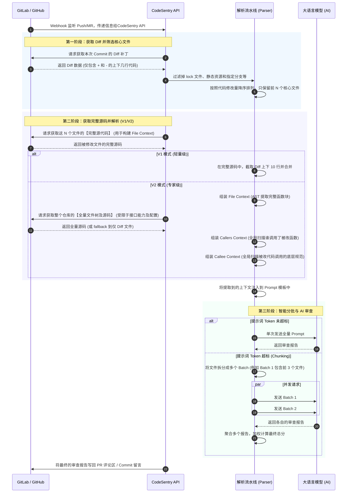

# CodeSentry

<div align="center">
  
</div>

> **声明 / Disclaimer**:
> 本项目为基于 [huangang/codesentry](https://github.com/huangang/codesentry) 二次开发的分支版本，主要用于**学习、教育及架构研究用途**。
> 感谢原作者 [huangang](https://github.com/huangang) 提供的优秀开源基础。

CodeSentry 是一款具备双引擎 (V1/V2) 智能上下文解析与超大 PR 自动分批审查能力的专业级 AI 代码审查系统，支持 GitHub、GitLab。

## 技术栈

- **后端**: Go 1.24+ (Fiber, GORM, Tree-sitter AST 解析)
- **前端**: React 18, TypeScript, Vite, TailwindCSS
- **数据库**: PostgreSQL
- **队列/缓存**: Redis (用于异步任务和去重)
- **大模型接入**: 原生支持 OpenAI, Anthropic (Claude), Ollama, Google Gemini

## 核心架构与操作流程

以下时序图展示了从代码提交到 AI 返回审查结果的完整交互过程。
*(阅图指南：从上往下看，箭头代表动作的发起方和接收方，虚线代表数据的返回。)*



## 提示词工程 (Prompt Engineering) 参考示例

为了让大模型能够精准地理解代码并输出结构化的审查报告，系统采用了**变量注入**和**严格指令**相结合的 Prompt 设计。以下是系统推荐的**标准提示词模板**。

> 💡 **自定义指南**：
> 1. **可以随意修改的地方**：您可以自由修改“角色设定”、“评分维度（比如改为满分 10 分或取消打分）”、“审查原则（比如增加对公司特定编码规范的强制要求）”以及“输出格式”。
> 2. **千万不能动的地方**：底部的四个变量占位符 `{{file_context}}`, `{{callers_context}}`, `{{callee_context}}`, `{{commits}}` 是系统底层动态替换的核心，**必须保留原样**（如果您的项目不需要 V2 的追溯，可以删掉 caller/callee 变量以节省 Token）。

### 系统默认 Prompt 模板

```markdown
你是一位资深的软件开发工程师。你的任务是对提交的代码进行专业、聚焦的代码审查。 
 
## 核心审查原则（最高优先级，绝对服从） 
1. **绝对聚焦修改行**：你**只能**审查带有 `+`（新增）和 `-`（删除）标记的代码行，以及它们对当前函数逻辑的直接影响。 
2. **无视历史遗留问题**：严禁指出未修改代码（没有 `+` 或 `-` 标记的行）中的 Bug、不规范或优化空间。只要不是这次改动引入的，就当没看见。 
3. **严格的跨文件双向校验**： 
   - **向外看 (Callers)**：如果本次修改改变了某函数的输入/输出定义，必须检查下方的【跨文件调用影响分析】，确认是否导致其他调用方崩溃。 
   - **向内看 (Callee)**：如果本次修改新增或修改了对某个底层函数的调用，必须检查下方的【被调用函数定义参考】，确认传入的参数类型和数量是否符合原函数要求。 
 
## 评分维度（总分 100 分） 
1. **修改逻辑的正确性（50 分）**：本次修改是否达到了预期目的，有没有引入新的 Bug。 
2. **跨模块兼容性（30 分）**：本次修改是否破坏了上下游的调用约定（重点结合 Callers/Callee 检查）。 
3. **代码健壮性与安全（15 分）**：新增的代码是否有安全隐患或可能导致异常。 
4. **提交信息质量（5 分）**：commit 信息是否清晰。 
 
## 输出格式（Markdown） 
请严格按照以下结构输出，不要说多余的废话： 
 
### 一、修改点审查意见（按函数分组） 
（请遍历提供的 Context，以被修改的函数/类为单位进行输出。如果该函数修改没有问题，请写“✅ 该函数修改无异常”） 
 
- **函数/模块名**：`generate_report` (文件: `Performance_monitor.py`) 
  - **问题/风险**：[直接说明带 `+` 或 `-` 的行有什么问题，或者与 Callers/Callee 有什么冲突] 
  - **优化建议**：[给出具体的修改代码] 
 
### 二、评分明细 
- 按四个评分维度给出具体分数和简短理由。 
 
### 三、总分（特别重要） 
- 格式必须为："总分:XX 分"（例如：总分:80 分）。 
 
--- 
**本次修改的代码及完整上下文参考 (Context & Diff)**： 
（带 `+` 和 `-` 标记的行代表本次修改，你只需关注这些行及其直接影响） 
{{file_context}} 
 
--- 
**跨文件调用影响分析 (Callers Context)**： 
（调用了本次修改函数的上游代码。请检查本次修改是否导致它们报错） 
{{callers_context}} 
 
--- 
**被调用函数定义参考 (Callee Context)**： 
（本次新增/修改代码中调用的底层函数定义。请检查本次调用传参是否正确） 
{{callee_context}} 
 
--- 
**提交历史（commits）**： 
{{commits}}
```

### Prompt 渲染效果示例 (大模型最终看到的视角)

当系统运行时，后端的引擎会将真实的源码提取出来并替换上述的占位符。以下是某次 `Performance_monitor.py` 提交后，**发给大模型的最终真实文本截取示例**：

````markdown
... (前面是您的指令和输出格式要求) ...

--- 
**本次修改的代码及完整上下文参考 (Context & Diff)**： 
（带 `+` 和 `-` 标记的行代表本次修改，你只需关注这些行及其直接影响） 
#### `Performance_monitor.py` (Lines 112-138) 
```python 
 112 |               interval: 监控间隔时间(秒) 
 113 |           """ 
 114 |           if self.monitoring: 
 115 |               return 
 116 |               
 117 |           self.monitoring = True 
 118 |           self.monitor_thread = threading.Thread( 
 119 |               target=self._monitor_loop, 
 120 |               args=(interval,), 
 121 |               daemon=True 
 122 |          ) 
 123 |          self.monitor_thread.start() 
 124 |          logger.info(f"开始系统监控，间隔{interval}秒") 
 125 | +        print(f"开始系统监控，间隔{interval}秒") 
 126 |          
 127 |      def stop_monitoring(self): 
 128 |          """停止监控系统资源""" 
 129 |           self.monitoring = False 
 130 |           if self.monitor_thread: 
 131 |               self.monitor_thread.join(timeout=2) 
 132 |           logger.info("停止系统监控") 
 133 |           logger.info("在干什么？") 
 134 |           
 135 |       def _monitor_loop(self, interval: float): 
 136 |           """监控循环""" 
 137 |           while self.monitoring: 
 138 |               try: 
``` 

#### `Performance_monitor.py` (Lines 170-196) 
```python 
 170 |           gpu_temperature = [] 
 171 |           
 172 |           if GPU_AVAILABLE: 
 173 |               try: 
 174 |                   gpus = GPUtil.getGPUs() 
 175 |                   gpu_count = len(gpus) 
 176 |                   for gpu in gpus: 
 177 |                       gpu_utilization.append(gpu.load * 100)  # 转换为百分比 
 178 |                       gpu_memory_used.append(gpu.memoryUsed / 1024)  # 转换为GB 
 179 |                       gpu_memory_total.append(gpu.memoryTotal / 1024)  # 转换为GB 
 180 |                      gpu_temperature.append(gpu.temperature) 
 181 |              except Exception as e: 
 182 |                  logger.warning(f"获取GPU信息失败: {e}") 
 183 | +                print(f"获取GPU信息失败: {e}") 
 184 |          
 185 |          return SystemMetrics( 
 186 |              cpu_percent=cpu_percent, 
 187 | 
 188 | 
 189 |               memory_percent=memory_percent, 
 190 |               memory_used_gb=memory_used_gb, 
 191 |               memory_total_gb=memory_total_gb, 
 192 |               memory_available_gb=memory_available_gb, 
 193 |               gpu_count=gpu_count, 
 194 |               gpu_utilization=gpu_utilization, 
 195 |               gpu_memory_used=gpu_memory_used, 
 196 |               gpu_memory_total=gpu_memory_total, 
``` 

--- 
**跨文件调用影响分析 (Callers Context)**： 
（调用了本次修改函数的上游代码。请检查本次修改是否导致它们报错） 
*(若无跨文件调用则为空)*

--- 
**被调用函数定义参考 (Callee Context)**： 
（本次新增/修改代码中调用的底层函数定义。请检查本次调用传参是否正确） 
*(若无底层调用则为空)*

--- 
**提交历史（commits）**： 
72b75651: Update Performance_monitor.py
````

*(注意：在上述渲染后的示例中，大模型可以清楚地看到代码的上下文行号，以及 `+` 标记出的新增打印语句，从而精准给出审查意见，避免胡乱猜测。)*

## 双引擎解析逻辑 (V1 vs V2)

为了在“审查精度”与“Token 成本/响应速度”之间取得最佳平衡，系统内置了两套代码解析引擎：

### V1 模式：轻量级极速审查

- **定位**：适合日常小迭代、前端 UI 微调、配置文件修改，成本极低。
- **逻辑**：不解析语法，纯文本提取修改点（Diff）上下 10 行。若多个修改点距离较近，自动合并为一个连贯代码块。

**V1 处理流程示例**：

```text
修改点 1 (Line 100) -> 提取 90~110 行
修改点 2 (Line 115) -> 提取 105~125 行
--- 智能合并 ---
最终发给 AI：提取 90~125 行 (包含两个修改点，无割裂感)
```

### V2 模式：专家级深度审查 (AST 语法树)

- **定位**：适合核心业务重构、底层数据结构变更，主打高精度防雷。
- **逻辑**：
  1. **Function Context**：将修改点所在的**整个函数/类**完整提取出来。
  2. **Callers Context (向上追溯)**：全网扫描谁调用了被修改的函数。
  3. **Callee Context (向下校验)**：全网扫描本次修改中调用的底层函数定义。
  4. **Orphan Hunks (孤儿代码)**：自动捕获全局变量、import 导入等不在函数内的代码。

**V2 处理流程示例**：

```text
用户修改了 `user.go` 中的 `func CheckAuth(token string) bool` -> 改为了 `func CheckAuth(token string, age int) bool`

系统自动收集并发给 AI：
1. [File Context]: 完整的 `CheckAuth` 源码，并用 + 和 - 标出改动。
2. [Callers Context]: 自动从 `api.go` 提取调用了 `CheckAuth` 的代码片段（AI 借此发现 api.go 还在传 1 个参数，抛出致命 Bug）。
```

## 核心 API 接口说明

### 后端核心接口

- `POST /api/webhook/:platform/:uuid`
  - **功能**: 接收代码托管平台的 Webhook 事件，触发审查队列。
- `GET /api/projects`
  - **功能**: 获取项目列表，配置代码仓库的鉴权信息、使用的 LLM 模型及审查模式 (V1/V2)。
- `POST /api/projects`
  - **功能**: 新增项目绑定。
- `PUT /api/prompts/:id`
  - **功能**: 更新提示词模板，支持动态注入 `{{file_context}}`、`{{callers_context}}` 等上下文变量。
- `GET /api/logs/review`
  - **功能**: 查询历史审查日志，支持分页、状态检索。
- `POST /api/logs/review/batch-retry`
  - **功能**: 批量重新触发失败或不满意的审查任务。
- `GET /metrics`
  - **功能**: Prometheus 监控指标接口，实时暴露队列堆积、API 耗时及大模型请求状态。

### 前端核心接口服务 (`src/services/api.ts`)

- `api.getProjects()` / `api.createProject()`: 项目管理接口调用。
- `api.getReviewLogs()`: 获取审查流水和统计数据。
- `api.getPrompts()` / `api.updatePrompt()`: 系统 Prompt 管理。

## 编译与 Docker 打包部署流程

### 1. 本地编译与运行 (开发环境)

**后端编译**:

```bash
cd backend
# 复制并修改配置文件 (配置 Postgres 连接)
cp ../config.yaml.example config.yaml
# 运行后端服务
go run ./cmd/server
```

**前端编译**:

```bash
cd frontend
npm install
npm run dev
```

### 2. 内网离线一键部署 (基于 docker-compose)

生产环境推荐使用项目根目录下的 `docker-compose.yml` 进行一键编排，它会自动拉起 **CodeSentry 主程序** 和 **PostgreSQL 数据库**。

**第一步：加载离线镜像**
在内网服务器上，将准备好的两个离线镜像包加载进 Docker：

```bash
# 1. 加载 PostgreSQL 数据库镜像
docker load -i postgres.tar

# 2. 加载 CodeSentry 主程序镜像
docker load -i code-reviewer-aoi.tar
```

**第二步：一键启动**
确保当前目录下有 `docker-compose.yml` 文件，直接执行：

```bash
docker-compose up -d
```

**`docker-compose.yml`** **核心配置说明**:

```yaml
version: '3.8'

services:
  # 1. db节点 (PostgreSQL): 使用加载好的 postgres 镜像。
  # 数据卷挂载在 ./data/postgres，保证容器重启或更新时数据不丢失。
  db:
    image: postgres:15-alpine
    container_name: code_review_db
    environment:
      POSTGRES_USER: postgres
      POSTGRES_PASSWORD: "123456"
      POSTGRES_DB: codesentry
    volumes:
      - ./data/postgres:/var/lib/postgresql/data
    ports:
      - "5432:5432"

  # 2. app节点 (CodeSentry): 依赖 db 启动。
  # 通过环境变量（如 DB_DSN）直接注入数据库连接信息，通过 OPENAI_API_KEY 注入大模型密钥。
  # 配置文件和日志挂载在 ./data/app。
  # 端口访问：本机的 8080 端口映射到了主程序的 Web 界面和 API 端口，启动后直接访问 http://IP:8080 即可。
  app:
    image: zhazha/code-reviewer-aoi:latest
    container_name: codesentry_app
    depends_on:
      - db
    ports:
      - "8080:8080"
    environment:
      # 对应 config.yaml 中的 server.port 和 server.mode
      - SERVER_PORT=8080
      - SERVER_MODE=release
      # 对应 config.yaml 中的 database.driver 和 database.dsn
      - DB_DRIVER=postgres
      - DB_DSN=host=db user=postgres password=123456 dbname=codesentry port=5432 sslmode=disable TimeZone=Asia/Shanghai
      # 对应 config.yaml 中的 jwt.secret 和 jwt.expire_hour
      - JWT_SECRET=your-secret-key-change-in-production
      - JWT_EXPIRE_HOUR=24
      # 大模型配置
      - OPENAI_API_KEY=your_openai_api_key
      - OPENAI_BASE_URL=https://api.openai.com/v1
    volumes:
      - ./data/app:/app/data
```

## 目录结构

```text
codesentry/
├── backend/                  # Go 后端服务
│   ├── cmd/
│   │   ├── scripts/          # 维护脚本 (更新分数、规则等)
│   │   └── server/           # 主程序启动入口 (main.go)
│   ├── internal/             # 核心私有逻辑
│   │   ├── config/           # yaml 配置文件解析
│   │   ├── handlers/         # HTTP API 路由与控制器层
│   │   ├── middleware/       # 中间件 (Auth鉴权, CORS, RateLimit等)
│   │   ├── models/           # GORM 数据库实体模型定义
│   │   ├── services/         # 核心业务逻辑层
│   │   │   ├── webhook/      # Webhook 事件接收与解析引擎
│   │   │   ├── ai.go         # 大模型调用与 Chunking 拆分引擎
│   │   │   ├── file_context.go # V1 上下文提取与合并引擎
│   │   │   ├── repo_map.go   # V2 AST 语法树与 Callers/Callee 追溯引擎
│   │   │   └── task_queue.go # 异步任务队列与 Redis 调度
│   │   └── utils/            # JWT、密码加密等通用工具类
│   ├── pkg/                  # 公共包 (Logger, 统一响应封装等)
│   ├── go.mod                # Go 依赖管理
│   └── .air.toml             # Air 热重载配置
├── frontend/                 # React 18 前端界面
│   ├── public/               # 静态资源 (图标, 图片等)
│   ├── src/
│   │   ├── components/       # 全局复用组件 (通知, 搜索, 图表等)
│   │   ├── constants/        # 全局常量与权限配置
│   │   ├── hooks/            # 自定义 Hooks (React Query 数据获取等)
│   │   ├── i18n/             # 国际化多语言配置 (中/英)
│   │   ├── layouts/          # 整体页面骨架布局
│   │   ├── pages/            # 核心业务页面视图
│   │   ├── services/         # Axios API 请求封装
│   │   ├── stores/           # Zustand 全局状态管理 (Auth, Theme)
│   │   └── types/            # TypeScript 全局接口定义
│   ├── package.json          # Node 依赖管理
│   └── vite.config.ts        # Vite 构建配置
├── Dockerfile                # 生产环境容器化打包脚本
├── docker-compose.yml        # 容器编排部署文件
├── config.yaml.example       # 后端配置示例文件
└── README.md                 # 项目说明文档
```

## 许可证 (License)

MIT License
