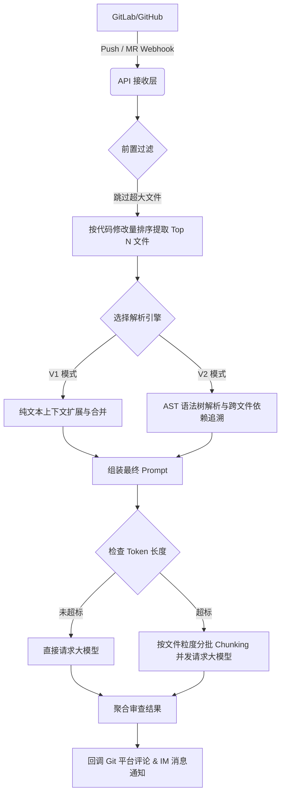

# CodeSentry

<div align="center">
  
</div>

> **声明 / Disclaimer**: 
> 本项目为基于 [huangang/codesentry](https://github.com/huangang/codesentry) 二次开发的分支版本，主要用于**学习、教育及架构研究用途**。
> 感谢原作者 [huangang](https://github.com/huangang) 提供的优秀开源基础。

CodeSentry 是一款具备双引擎 (V1/V2) 智能上下文解析与超大 PR 自动分批审查能力的专业级 AI 代码审查系统，支持 GitHub、GitLab。

## 技术栈

- **后端**: Go 1.24+ (Fiber, GORM, Tree-sitter AST 解析)
- **前端**: React 18, TypeScript, Vite, TailwindCSS
- **数据库**: PostgreSQL
- **队列/缓存**: Redis (用于异步任务和去重)
- **大模型接入**: 原生支持 OpenAI, Anthropic (Claude), Ollama, Google Gemini

## 核心架构与操作流程

本系统在处理代码审查（支持 Push 和 Merge Request 事件）时，采用多级防护与智能解析流水线：



## 双引擎解析逻辑 (V1 vs V2)

为了在“审查精度”与“Token 成本/响应速度”之间取得最佳平衡，系统内置了两套代码解析引擎：

### V1 模式：轻量级极速审查
- **定位**：适合日常小迭代、前端 UI 微调、配置文件修改，成本极低。
- **逻辑**：不解析语法，纯文本提取修改点（Diff）上下 10 行。若多个修改点距离较近，自动合并为一个连贯代码块。

**V1 处理流程示例**：
```text
修改点 1 (Line 100) -> 提取 90~110 行
修改点 2 (Line 115) -> 提取 105~125 行
--- 智能合并 ---
最终发给 AI：提取 90~125 行 (包含两个修改点，无割裂感)
```

### V2 模式：专家级深度审查 (AST 语法树)
- **定位**：适合核心业务重构、底层数据结构变更，主打高精度防雷。
- **逻辑**：
  1. **Function Context**：将修改点所在的**整个函数/类**完整提取出来。
  2. **Callers Context (向上追溯)**：全网扫描谁调用了被修改的函数。
  3. **Callee Context (向下校验)**：全网扫描本次修改中调用的底层函数定义。
  4. **Orphan Hunks (孤儿代码)**：自动捕获全局变量、import 导入等不在函数内的代码。

**V2 处理流程示例**：
```text
用户修改了 `user.go` 中的 `func CheckAuth(token string) bool` -> 改为了 `func CheckAuth(token string, age int) bool`

系统自动收集并发给 AI：
1. [File Context]: 完整的 `CheckAuth` 源码，并用 + 和 - 标出改动。
2. [Callers Context]: 自动从 `api.go` 提取调用了 `CheckAuth` 的代码片段（AI 借此发现 api.go 还在传 1 个参数，抛出致命 Bug）。
```

## 核心 API 接口说明

### 后端核心接口
- `POST /api/webhook/:platform/:uuid`
  - **功能**: 接收代码托管平台的 Webhook 事件，触发审查队列。
- `GET /api/projects`
  - **功能**: 获取项目列表，配置代码仓库的鉴权信息、使用的 LLM 模型及审查模式 (V1/V2)。
- `POST /api/projects`
  - **功能**: 新增项目绑定。
- `PUT /api/prompts/:id`
  - **功能**: 更新提示词模板，支持动态注入 `{{file_context}}`、`{{callers_context}}` 等上下文变量。
- `GET /api/logs/review`
  - **功能**: 查询历史审查日志，支持分页、状态检索。
- `POST /api/logs/review/batch-retry`
  - **功能**: 批量重新触发失败或不满意的审查任务。
- `GET /metrics`
  - **功能**: Prometheus 监控指标接口，实时暴露队列堆积、API 耗时及大模型请求状态。

### 前端核心接口服务 (`src/services/api.ts`)
- `api.getProjects()` / `api.createProject()`: 项目管理接口调用。
- `api.getReviewLogs()`: 获取审查流水和统计数据。
- `api.getPrompts()` / `api.updatePrompt()`: 系统 Prompt 管理。

## 编译与 Docker 打包流程

### 1. 本地编译与运行
**后端编译**:
```bash
cd backend
# 复制并修改配置文件 (配置 Postgres 连接)
cp ../config.yaml.example config.yaml
# 运行后端服务
go run ./cmd/server
```

**前端编译**:
```bash
cd frontend
npm install
npm run dev
```

### 2. Docker 生产环境打包
项目根目录提供了完整的 `Dockerfile`，采用多阶段构建，将前端静态文件打包并嵌入 Go 二进制文件中。

**构建镜像**:
```bash
docker build -t zhazha/code-reviewer-aoi:latest .
```

**导出离线包 (适用于内网部署)**:
```bash
docker save -o code-reviewer-aoi.tar zhazha/code-reviewer-aoi:latest
```

**在内网加载并运行**:
```bash
# 加载镜像
docker load -i code-reviewer-aoi.tar

# 运行容器 (请挂载 config.yaml 和 data 目录)
docker run -d \
  --name code-reviewer \
  -p 8080:8080 \
  -v $(pwd)/config.yaml:/app/config.yaml \
  -v $(pwd)/data:/app/data \
  zhazha/code-reviewer-aoi:latest
```

## Quick Start

### Prerequisites

- Go 1.24+
- Node.js 20+
- Docker (optional)

### Development Setup

#### Backend

```bash
cd backend

# Create config file
cp ../config.yaml.example config.yaml
# Edit config.yaml with your settings

# Run
go run ./cmd/server
```

#### Frontend

```bash
cd frontend

# Install dependencies
npm install

# Run development server
npm run dev
```

Access the application at `http://localhost:5173`

**Default credentials**: `admin` / `admin`

### Docker Deployment

```bash
# Pull from Docker Hub
docker pull huangangzhang/codesentry:latest

# Or pull from GitHub Container Registry
docker pull ghcr.io/huangang/codesentry:latest
```

**Choose your database:**

```bash
# MySQL (default, recommended for production)
docker-compose up -d

# SQLite (simple, single file)
docker-compose -f docker-compose.sqlite.yml up -d

# PostgreSQL
docker-compose -f docker-compose.postgres.yml up -d
```

**Or run directly (SQLite):**

```bash
docker run -d -p 8080:8080 -v codesentry-data:/app/data huangangzhang/codesentry:latest
```

For local development (build from source):

```bash
docker-compose -f docker-compose.dev.yml up --build
```

Access the application at `http://localhost:8080`

### Build Script (Local)

```bash
# One-command build (frontend + backend combined)
./build.sh

# Run the binary
./codesentry
```

This builds frontend, embeds it into the Go binary, producing a single executable.

## Configuration

Copy `config.yaml.example` to `config.yaml` and update:

```yaml
server:
  port: 8080
  mode: release  # debug, release, test

database:
  driver: sqlite   # sqlite, mysql, postgres
  dsn: data/codesentry.db
  # For MySQL: user:password@tcp(host:port)/dbname?charset=utf8mb4&parseTime=True&loc=Local
  # For PostgreSQL: host=localhost user=postgres password=xxx dbname=codesentry port=5432 sslmode=disable

jwt:
  secret: your-secret-key-change-in-production
  expire_hour: 24
```

### Session & Token Expiration

CodeSentry uses a **short-lived access token** (JWT) plus a **long-lived refresh token** for silent re-login.

- **Access token**: returned by `POST /api/auth/login`, stored by frontend in `localStorage` and sent as `Authorization: Bearer <token>`.
- **Refresh token**: stored in a **httpOnly cookie** (not accessible from JavaScript), used by `POST /api/auth/refresh`.

Default expirations (configurable via System Config in DB):

- `auth_access_token_expire_hours` (default: `2`)
- `auth_refresh_token_expire_hours` (default: `720` = 30 days)

`jwt.expire_hour` in `config.yaml` is used as a fallback default for access token expiration.

> **Note**: When the access token expires, the frontend will automatically call `/api/auth/refresh` and retry the original request. Only when refresh fails will it redirect to `/login`.

The frontend also performs **proactive refresh** before token expiration (default: refresh 5 minutes before access token expires) to reduce user-visible 401 interruptions.

### CORS (Important for Refresh Cookie)

Because refresh token is stored in a cookie, deployments that serve frontend and backend on different origins must configure CORS correctly:

- `Access-Control-Allow-Credentials: true` is required
- `Access-Control-Allow-Origin` **cannot** be `*`
- Prefer an explicit origin allowlist in production

> **Note**: All business configurations (LLM models, LDAP, prompts, IM bots, Git credentials) are managed via the web UI and stored in the database.

## Webhook Setup

### Recommended: Unified Webhook (Auto-detect)

Use a single webhook URL for GitLab, GitHub, and Bitbucket:

```
https://your-domain/webhook
# or
https://your-domain/review/webhook
```

The system automatically detects the platform via request headers.

### GitHub

1. Go to Repository Settings > Webhooks > Add webhook
2. Payload URL: `https://your-domain/webhook`
3. Content type: `application/json`
4. Secret: Your configured webhook secret
5. Events: Select "Pull requests" and "Pushes"

### GitLab

1. Go to Project Settings > Webhooks
2. URL: `https://your-domain/webhook`
3. Secret Token: Your configured webhook secret
4. Trigger: Push events, Merge request events

### Bitbucket

1. Go to Repository Settings > Webhooks > Add webhook
2. URL: `https://your-domain/webhook`
3. Secret: Your configured webhook secret (for HMAC-SHA256 signature)
4. Triggers: Select "Repository push" and "Pull request created/updated"

## API Endpoints

### Authentication

- `POST /api/auth/login` - Login
- `POST /api/auth/refresh` - Refresh access token (uses httpOnly refresh cookie)
- `GET /api/auth/config` - Get auth config
- `GET /api/auth/me` - Get current user
- `POST /api/auth/logout` - Logout (revokes refresh token and clears cookie)
- `POST /api/auth/change-password` - Change password (local users only)

### System Config (Admin)

- `GET /api/system-config/auth-session` - Get auth session config
- `PUT /api/system-config/auth-session` - Update auth session config

### Projects

- `GET /api/projects` - List projects
- `POST /api/projects` - Create project
- `GET /api/projects/:id` - Get project
- `PUT /api/projects/:id` - Update project
- `DELETE /api/projects/:id` - Delete project

### Review Logs

- `GET /api/review-logs` - List review logs
- `GET /api/review-logs/:id` - Get review detail
- `POST /api/review-logs/:id/retry` - Retry failed review (admin only)
- `DELETE /api/review-logs/:id` - Delete review log (admin only)

### Real-time Events (SSE)

- `GET /api/events/reviews` - Stream review status updates (requires `token` query param)

### Users

- `GET /api/users` - List users (admin only)
- `PUT /api/users/:id` - Update user (admin only)
- `DELETE /api/users/:id` - Delete user (admin only)

### Dashboard

- `GET /api/dashboard/stats` - Get statistics

### Global Search

- `GET /api/search?q=<query>&limit=<n>` - Search across reviews and projects

### Reports

- `GET /api/reports?period=weekly|monthly&project_id=N` - Period stats with trend and author rankings

### Review Logs

- `GET /api/review-logs` - List review logs (supports score range, status, author, date filters)
- `GET /api/review-logs/:id` - Get review detail
- `GET /api/review-logs/export` - Export review logs as CSV (admin only)
- `POST /api/review-logs/:id/retry` - Retry failed review (admin only)
- `POST /api/review-logs/batch-retry` - Batch retry (admin only)
- `POST /api/review-logs/batch-delete` - Batch delete (admin only)
- `DELETE /api/review-logs/:id` - Delete review log (admin only)
- `PUT /api/review-logs/:id/score` - Manually override review score (admin only)

### Issue Trackers

- `GET /api/issue-trackers` - List issue tracker integrations (admin only)
- `POST /api/issue-trackers` - Create integration (admin only)
- `PUT /api/issue-trackers/:id` - Update integration (admin only)
- `DELETE /api/issue-trackers/:id` - Delete integration (admin only)
- `POST /api/issue-trackers/:id/test` - Test connection (admin only)

### Auto-Fix PR

- `POST /api/review-logs/:id/fix` - Request AI-generated fix PR/MR (admin only)
- `GET /api/review-logs/:id/fix-status` - Get fix status (admin only)

### Review Rules (CI/CD Policies)

- `GET /api/review-rules` - List review rules (admin only)
- `POST /api/review-rules` - Create rule (admin only)
- `PUT /api/review-rules/:id` - Update rule (admin only)
- `DELETE /api/review-rules/:id` - Delete rule (admin only)
- `POST /api/review-rules/evaluate/:id` - Test rules against a review log (admin only)

### Member Analysis

- `GET /api/members` - List member statistics
- `GET /api/members/detail` - Get member detail with trend and project stats
- `GET /api/members/overview` - Get team overview (total stats, trend, score distribution, top members)

### LLM Config

- `GET /api/llm-configs` - List LLM configs
- `GET /api/llm-configs/active` - List active LLM configs (for project selection)
- `POST /api/llm-configs` - Create LLM config
- `PUT /api/llm-configs/:id` - Update LLM config
- `DELETE /api/llm-configs/:id` - Delete LLM config

### Prompt Templates

- `GET /api/prompts` - List prompt templates
- `GET /api/prompts/:id` - Get prompt template detail
- `GET /api/prompts/default` - Get default prompt template
- `GET /api/prompts/active` - List active prompt templates
- `POST /api/prompts` - Create prompt template (admin only)
- `PUT /api/prompts/:id` - Update prompt template (admin only)
- `DELETE /api/prompts/:id` - Delete prompt template (admin only)
- `POST /api/prompts/:id/set-default` - Set as default template (admin only)

### IM Bots

- `GET /api/im-bots` - List IM bots
- `POST /api/im-bots` - Create IM bot
- `PUT /api/im-bots/:id` - Update IM bot
- `DELETE /api/im-bots/:id` - Delete IM bot

### Daily Reports

- `GET /api/daily-reports` - List daily reports
- `GET /api/daily-reports/:id` - Get daily report detail
- `POST /api/daily-reports/generate` - Generate daily report (manual, no notification)
- `POST /api/daily-reports/:id/resend` - Send/resend notification

### Webhooks

- `POST /webhook` - **Unified webhook (auto-detect GitLab/GitHub/Bitbucket, recommended)**
- `POST /review/webhook` - Alias for unified webhook
- `POST /api/webhook` - Unified webhook under /api prefix
- `POST /api/review/webhook` - Alias under /api prefix
- `POST /api/webhook/gitlab` - GitLab webhook (auto-detect project by URL)
- `POST /api/webhook/github` - GitHub webhook (auto-detect project by URL)
- `POST /api/webhook/gitlab/:project_id` - GitLab webhook (with project ID)
- `POST /api/webhook/github/:project_id` - GitHub webhook (with project ID)
- `POST /api/webhook/bitbucket` - Bitbucket webhook (auto-detect project by URL)
- `POST /api/webhook/bitbucket/:project_id` - Bitbucket webhook (with project ID)

### Sync Review (for Git Hooks)

- `POST /review/sync` - Synchronous code review for pre-receive hooks
- `POST /api/review/sync` - Same endpoint under /api prefix
- `GET /review/score?commit_sha=xxx` - Query review status/score by commit SHA
- `GET /api/review/score?commit_sha=xxx` - Same endpoint under /api prefix

Request body:

```json
{
  "project_url": "https://gitlab.example.com/group/project",
  "commit_sha": "abc123...",
  "ref": "refs/heads/main",
  "author": "John Doe",
  "message": "feat: add new feature",
  "diffs": "diff --git a/file.go..."
}
```

Response:

```json
{
  "passed": true,
  "score": 85,
  "min_score": 60,
  "message": "Score: 85/100 (min: 60)",
  "review_id": 123
}
```

See `scripts/pre-receive-hook.sh` for GitLab pre-receive hook example.

### System Logs

- `GET /api/system-logs` - List system logs
- `GET /api/system-logs/modules` - Get module list
- `GET /api/system-logs/retention` - Get log retention days
- `PUT /api/system-logs/retention` - Set log retention days
- `POST /api/system-logs/cleanup` - Manually cleanup old logs

### Health Check & Metrics

- `GET /health` - Service health check
- `GET /metrics` - Prometheus metrics

## Project Structure

```
codesentry/
├── backend/
│   ├── cmd/server/          # Application entry point
│   ├── internal/
│   │   ├── config/          # Configuration
│   │   ├── handlers/        # HTTP handlers
│   │   ├── middleware/      # Auth, CORS middleware
│   │   ├── models/          # Database models
│   │   ├── services/        # Business logic
│   │   └── utils/           # Utilities
│   └── go.mod
├── frontend/
│   ├── src/
│   │   ├── i18n/            # Internationalization
│   │   ├── layouts/         # Layout components
│   │   ├── pages/           # Page components
│   │   ├── services/        # API services
│   │   ├── stores/          # State management
│   │   └── types/           # TypeScript types
│   └── package.json
├── Dockerfile
├── docker-compose.yml
├── config.yaml.example
├── README.md
└── README_zh.md
```

## Tech Stack

### Backend

- Go 1.24
- Gin v1.11 (HTTP framework)
- GORM v1.31 (ORM)
- JWT authentication
- LDAP support

### Frontend

- React 19
- TypeScript 5.9
- Ant Design 5
- TanStack Query (data fetching & caching)
- Recharts
- Zustand (state management)
- React Router 7
- react-i18next (internationalization)
- react-markdown (review result rendering)

## License

MIT
