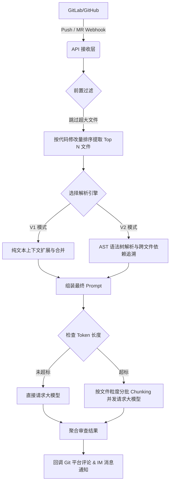

# CodeSentry

<div align="center">
  
</div>

> **声明 / Disclaimer**: 
> 本项目为基于 [huangang/codesentry](https://github.com/huangang/codesentry) 二次开发的分支版本，主要用于**学习、教育及架构研究用途**。
> 感谢原作者 [huangang](https://github.com/huangang) 提供的优秀开源基础。

CodeSentry 是一款具备双引擎 (V1/V2) 智能上下文解析与超大 PR 自动分批审查能力的专业级 AI 代码审查系统，支持 GitHub、GitLab。

## 技术栈

- **后端**: Go 1.24+ (Fiber, GORM, Tree-sitter AST 解析)
- **前端**: React 18, TypeScript, Vite, TailwindCSS
- **数据库**: PostgreSQL
- **队列/缓存**: Redis (用于异步任务和去重)
- **大模型接入**: 原生支持 OpenAI, Anthropic (Claude), Ollama, Google Gemini

## 核心架构与操作流程

本系统在处理代码审查（支持 Push 和 Merge Request 事件）时，采用多级防护与智能解析流水线：



## 双引擎解析逻辑 (V1 vs V2)

为了在“审查精度”与“Token 成本/响应速度”之间取得最佳平衡，系统内置了两套代码解析引擎：

### V1 模式：轻量级极速审查
- **定位**：适合日常小迭代、前端 UI 微调、配置文件修改，成本极低。
- **逻辑**：不解析语法，纯文本提取修改点（Diff）上下 10 行。若多个修改点距离较近，自动合并为一个连贯代码块。

**V1 处理流程示例**：
```text
修改点 1 (Line 100) -> 提取 90~110 行
修改点 2 (Line 115) -> 提取 105~125 行
--- 智能合并 ---
最终发给 AI：提取 90~125 行 (包含两个修改点，无割裂感)
```

### V2 模式：专家级深度审查 (AST 语法树)
- **定位**：适合核心业务重构、底层数据结构变更，主打高精度防雷。
- **逻辑**：
  1. **Function Context**：将修改点所在的**整个函数/类**完整提取出来。
  2. **Callers Context (向上追溯)**：全网扫描谁调用了被修改的函数。
  3. **Callee Context (向下校验)**：全网扫描本次修改中调用的底层函数定义。
  4. **Orphan Hunks (孤儿代码)**：自动捕获全局变量、import 导入等不在函数内的代码。

**V2 处理流程示例**：
```text
用户修改了 `user.go` 中的 `func CheckAuth(token string) bool` -> 改为了 `func CheckAuth(token string, age int) bool`

系统自动收集并发给 AI：
1. [File Context]: 完整的 `CheckAuth` 源码，并用 + 和 - 标出改动。
2. [Callers Context]: 自动从 `api.go` 提取调用了 `CheckAuth` 的代码片段（AI 借此发现 api.go 还在传 1 个参数，抛出致命 Bug）。
```

## 核心 API 接口说明

### 后端核心接口
- `POST /api/webhook/:platform/:uuid`
  - **功能**: 接收代码托管平台的 Webhook 事件，触发审查队列。
- `GET /api/projects`
  - **功能**: 获取项目列表，配置代码仓库的鉴权信息、使用的 LLM 模型及审查模式 (V1/V2)。
- `POST /api/projects`
  - **功能**: 新增项目绑定。
- `PUT /api/prompts/:id`
  - **功能**: 更新提示词模板，支持动态注入 `{{file_context}}`、`{{callers_context}}` 等上下文变量。
- `GET /api/logs/review`
  - **功能**: 查询历史审查日志，支持分页、状态检索。
- `POST /api/logs/review/batch-retry`
  - **功能**: 批量重新触发失败或不满意的审查任务。
- `GET /metrics`
  - **功能**: Prometheus 监控指标接口，实时暴露队列堆积、API 耗时及大模型请求状态。

### 前端核心接口服务 (`src/services/api.ts`)
- `api.getProjects()` / `api.createProject()`: 项目管理接口调用。
- `api.getReviewLogs()`: 获取审查流水和统计数据。
- `api.getPrompts()` / `api.updatePrompt()`: 系统 Prompt 管理。

## 编译与 Docker 打包流程

### 1. 本地编译与运行
**后端编译**:
```bash
cd backend
# 复制并修改配置文件 (配置 Postgres 连接)
cp ../config.yaml.example config.yaml
# 运行后端服务
go run ./cmd/server
```

**前端编译**:
```bash
cd frontend
npm install
npm run dev
```

### 2. Docker 生产环境打包
项目根目录提供了完整的 `Dockerfile`，采用多阶段构建，将前端静态文件打包并嵌入 Go 二进制文件中。

**构建镜像**:
```bash
docker build -t zhazha/code-reviewer-aoi:latest .
```

**导出离线包 (适用于内网部署)**:
```bash
docker save -o code-reviewer-aoi.tar zhazha/code-reviewer-aoi:latest
```

**在内网加载并运行**:
```bash
# 加载镜像
docker load -i code-reviewer-aoi.tar

# 运行容器 (请挂载 config.yaml 和 data 目录)
docker run -d \
  --name code-reviewer \
  -p 8080:8080 \
  -v $(pwd)/config.yaml:/app/config.yaml \
  -v $(pwd)/data:/app/data \
  zhazha/code-reviewer-aoi:latest
```

## 配置说明

复制 `config.yaml.example` 为 `config.yaml` 并根据需要进行修改：

```yaml
server:
  port: 8080
  mode: release  # debug, release, test

database:
  driver: postgres # 生产环境推荐使用 postgres
  # PostgreSQL 连接示例: host=localhost user=postgres password=xxx dbname=codesentry port=5432 sslmode=disable
  dsn: host=localhost user=postgres password=xxx dbname=codesentry port=5432 sslmode=disable

jwt:
  secret: your-secret-key-change-in-production
  expire_hour: 24
```

## Webhook 接入指南

您只需要在代码托管平台上配置一个统一的 Webhook 地址，系统会自动识别平台类型（GitHub / GitLab）。

**Webhook URL 示例**:
`https://your-domain/api/webhook/auto/default`

### GitLab 配置步骤
1. 进入项目设置 (Project Settings) > Webhooks
2. URL 填写: `https://your-domain/api/webhook/gitlab/default`
3. Secret Token 填写: 您在系统后台配置的 Webhook Secret
4. Trigger (触发器): 勾选 **Push events** 和 **Merge request events**

### GitHub 配置步骤
1. 进入仓库设置 (Repository Settings) > Webhooks > Add webhook
2. Payload URL 填写: `https://your-domain/api/webhook/github/default`
3. Content type 选择: `application/json`
4. Secret 填写: 您在系统后台配置的 Webhook Secret
5. Events (事件): 勾选 **Pull requests** 和 **Pushes**
## 目录结构

```text
codesentry/
├── backend/
│   ├── cmd/server/          # 后端启动入口
│   ├── internal/
│   │   ├── config/          # 配置文件加载
│   │   ├── handlers/        # API 路由与控制器
│   │   ├── middleware/      # Auth鉴权、CORS等中间件
│   │   ├── models/          # GORM 数据库模型
│   │   ├── services/        # 核心业务逻辑 (AI引擎, Webhook处理)
│   │   └── utils/           # 工具类
│   └── go.mod
├── frontend/
│   ├── src/
│   │   ├── i18n/            # 国际化配置
│   │   ├── layouts/         # 页面布局组件
│   │   ├── pages/           # 核心业务页面
│   │   ├── services/        # 前端 API 请求封装
│   │   ├── stores/          # Zustand 状态管理
│   │   └── types/           # TypeScript 类型定义
│   └── package.json
├── Dockerfile               # 生产环境打包构建文件
├── docker-compose.yml       # 容器编排文件
├── config.yaml.example      # 后端配置模板
└── README.md
```

## 许可证 (License)

MIT License
